# 14 — Diagrams

**Document version:** 1.0
**Date:** 2026-07-25

All diagrams are Mermaid source, renderable on GitHub, in VS Code with a Mermaid extension, or at
<https://mermaid.live>.

---

## 1. Use Case Diagram

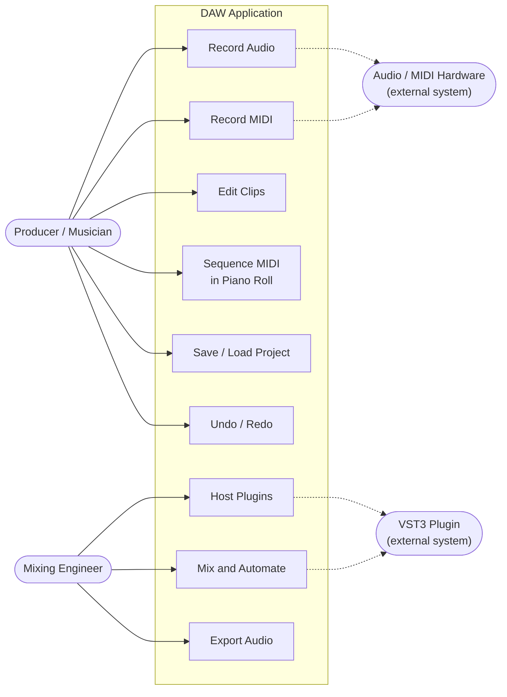

---

## 2. Data Flow Diagram — Level 0 (Context)

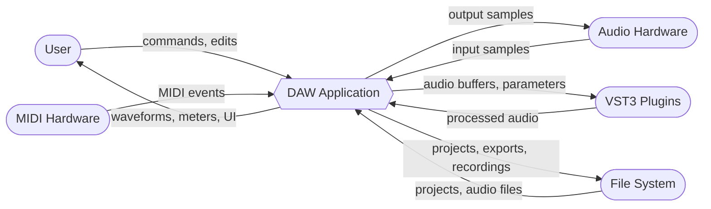

---

## 3. Data Flow Diagram — Level 1

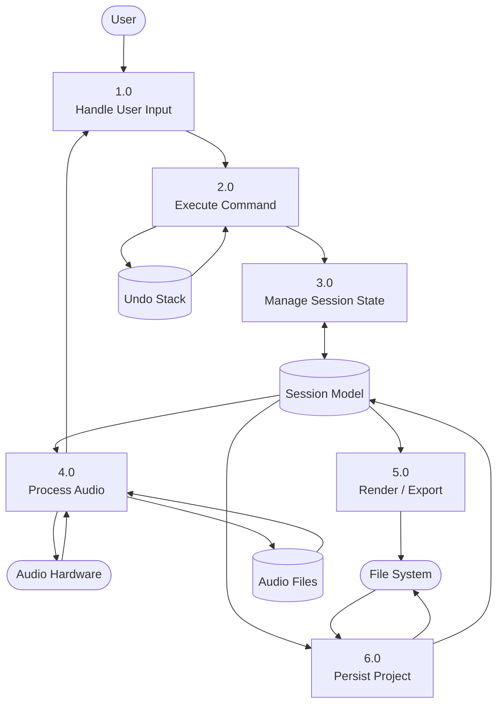

---

## 4. Class Diagram — Core Model

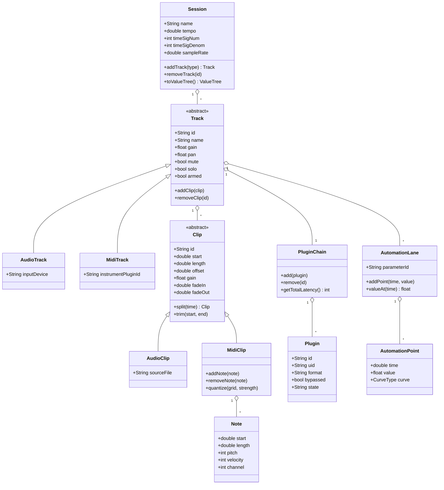

---

## 5. Class Diagram — Command & Undo

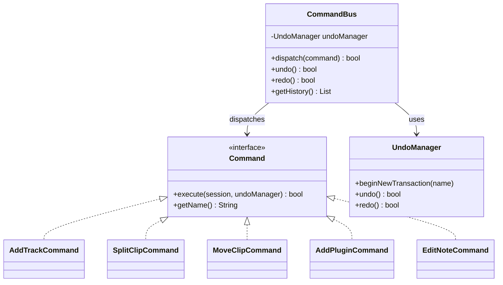

---

## 6. Sequence — Recording Audio

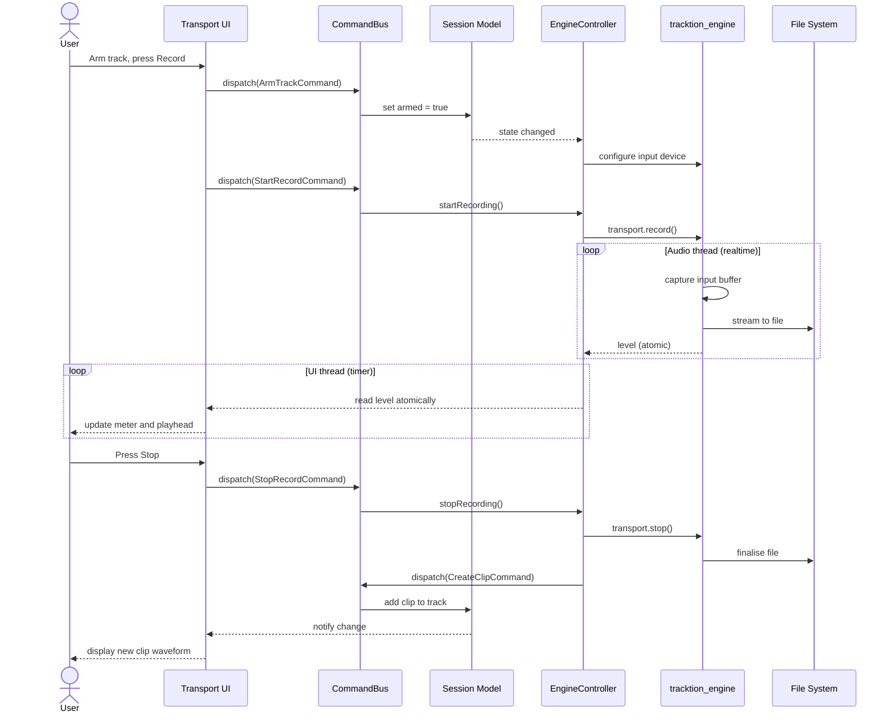

---

## 7. Sequence — Loading and Using a Plugin

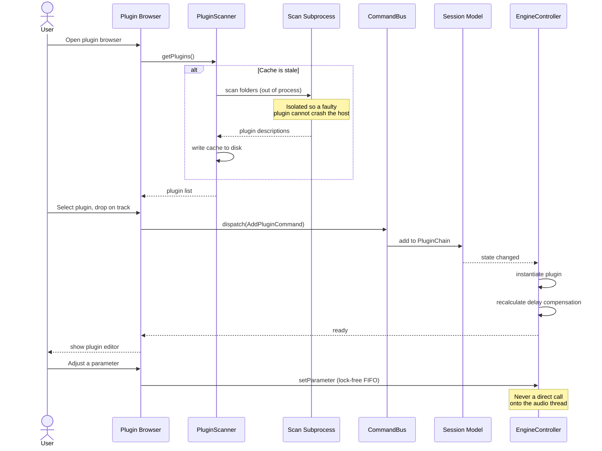

---

## 8. Sequence — Export with Null-Test Verification

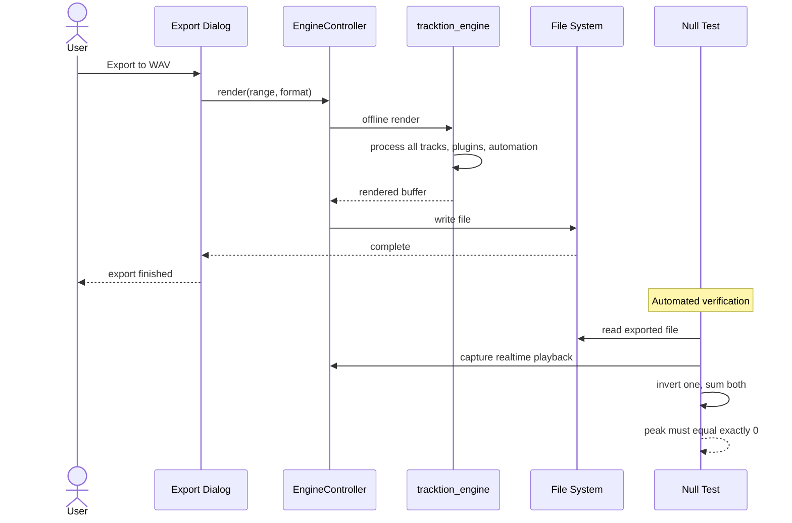

---

## 9. Architecture Layers

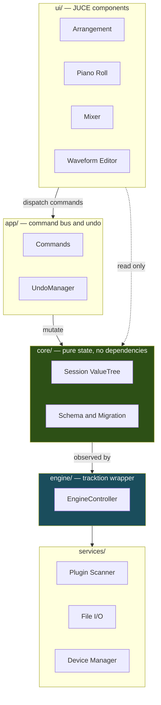

> The dependency rule is one-way and downward. `ui/` never calls `engine/` directly — it dispatches
> commands. `core/` depends on nothing, which is what makes it testable without audio hardware.

---

## 10. Threading Model

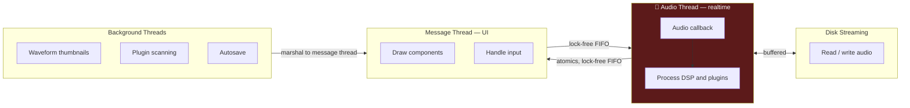

> **The audio thread performs no allocation, no locking, and no I/O.** All communication crosses
> thread boundaries through lock-free structures or atomics. This constraint (NFR6) is enforced by a
> debug-build detector added in Phase 2 — see [`11-testing-strategy.md`](11-testing-strategy.md) §5.

---

## 11. Entity Relationship — Project File

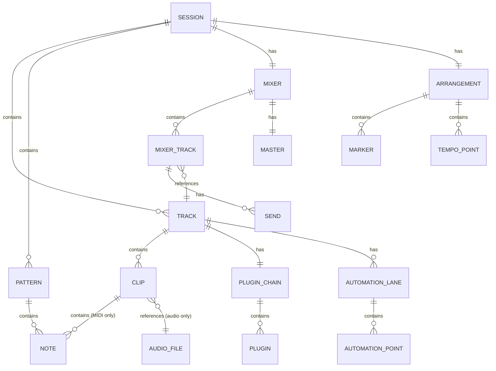

---

## 12. Development Phases

```mermaid
flowchart LR
    P1["1<br/>Foundation<br/>wk 1"] --> P2["2<br/>Session and<br/>Transport<br/>wk 2-3"]
    P2 --> P3["3<br/>Tracks and<br/>Waveforms<br/>wk 4"]
    P3 --> P4["4<br/>Audio<br/>Recording<br/>wk 5-6"]
    P4 --> P5["5<br/>MIDI<br/>Recording<br/>wk 6"]
    P5 --> P6["6<br/>Clip<br/>Editing<br/>wk 7-8"]
    P6 --> P7["7<br/>Plugin<br/>Hosting<br/>wk 9-10"]
    P7 --> P8["8<br/>Built-in<br/>Effects<br/>wk 10"]
    P8 --> P9["9<br/>Piano Roll<br/>wk 11-12"]
    P9 --> P10["10<br/>Patterns<br/>wk 12"]
    P10 --> P11["11<br/>Mixer and<br/>Automation<br/>wk 13-14"]
    P11 --> P12["12<br/>Persistence<br/>and Export<br/>wk 15"]
    P12 --> P13["13<br/>Stabilise<br/>and Demo<br/>wk 16"]

    style P4 fill:#2d5016,color:#fff
    style P7 fill:#5c4a1a,color:#fff
    style P10 fill:#4a4a4a,color:#fff
```

> Green marks the point at which the application becomes genuinely usable for real work.
> Amber marks the highest-risk integration. Grey marks the first phase to cut if the schedule slips.
